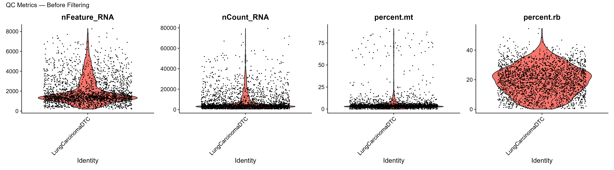
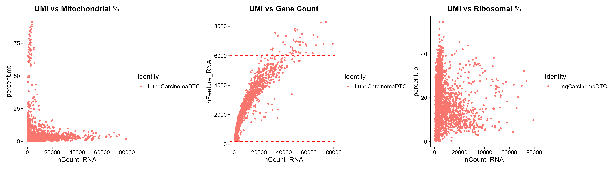
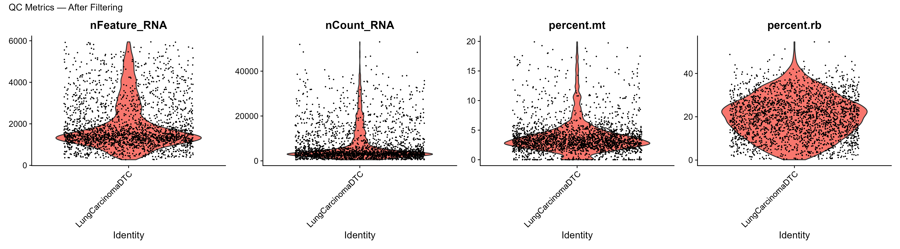
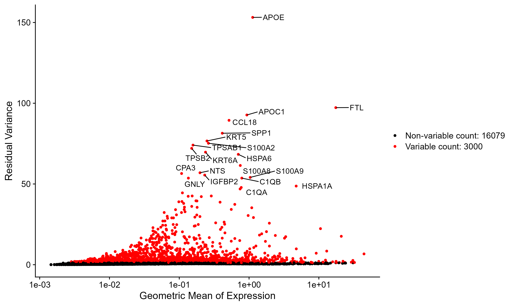
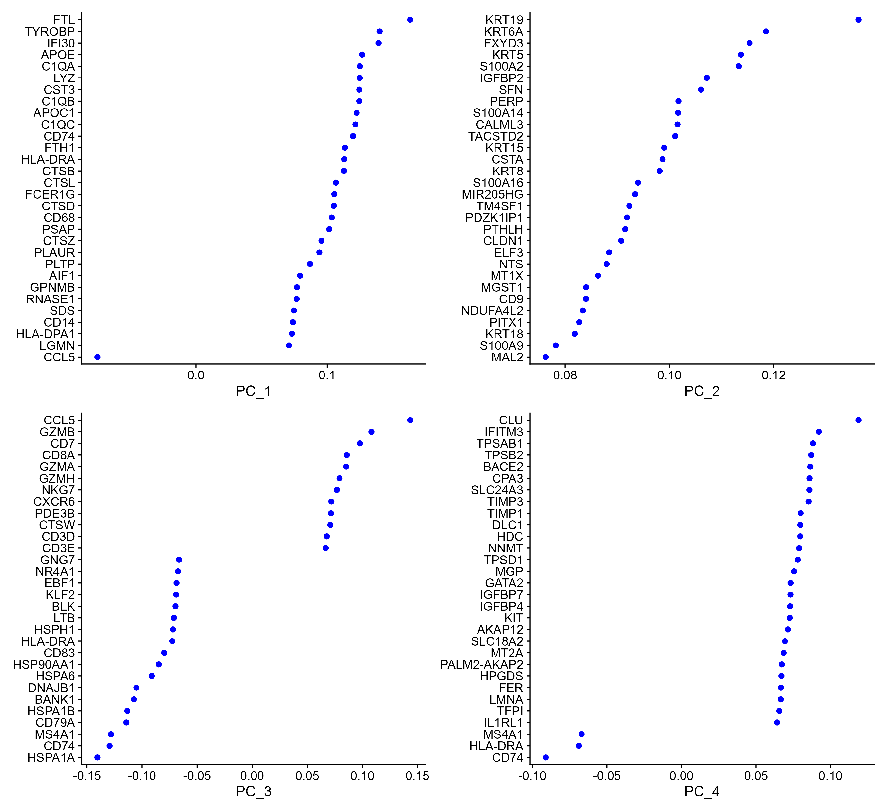
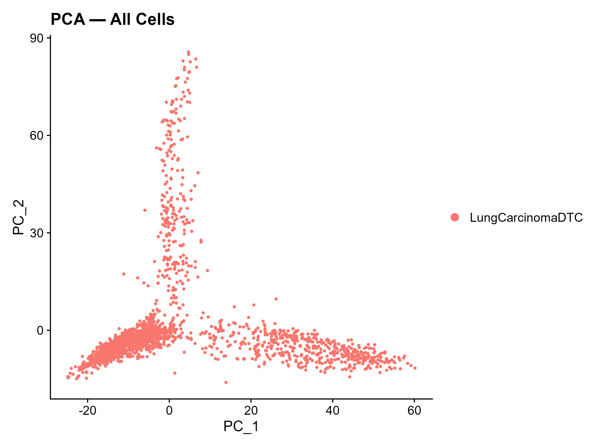
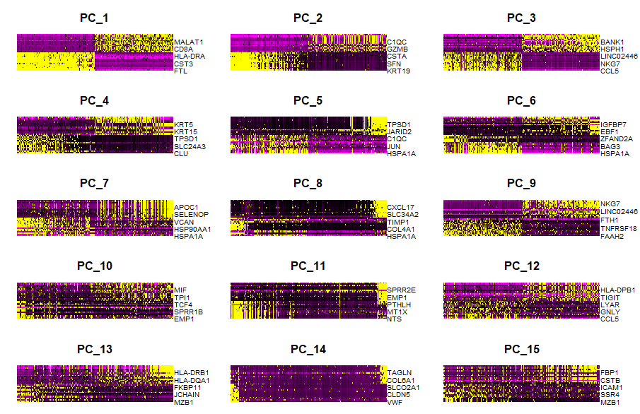
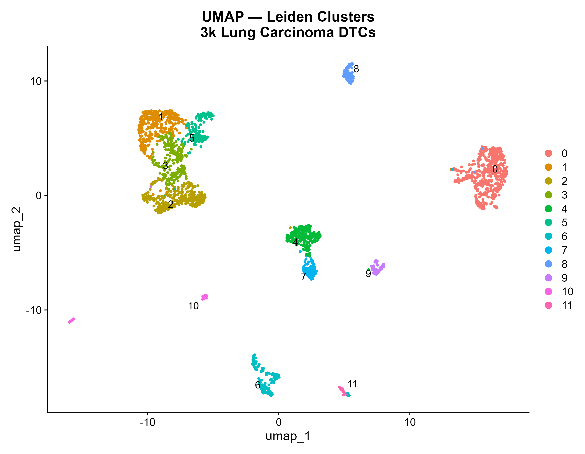
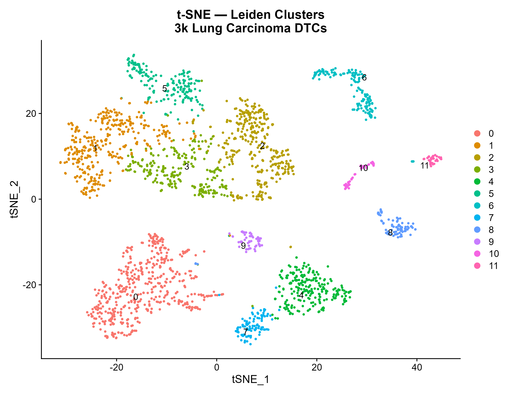
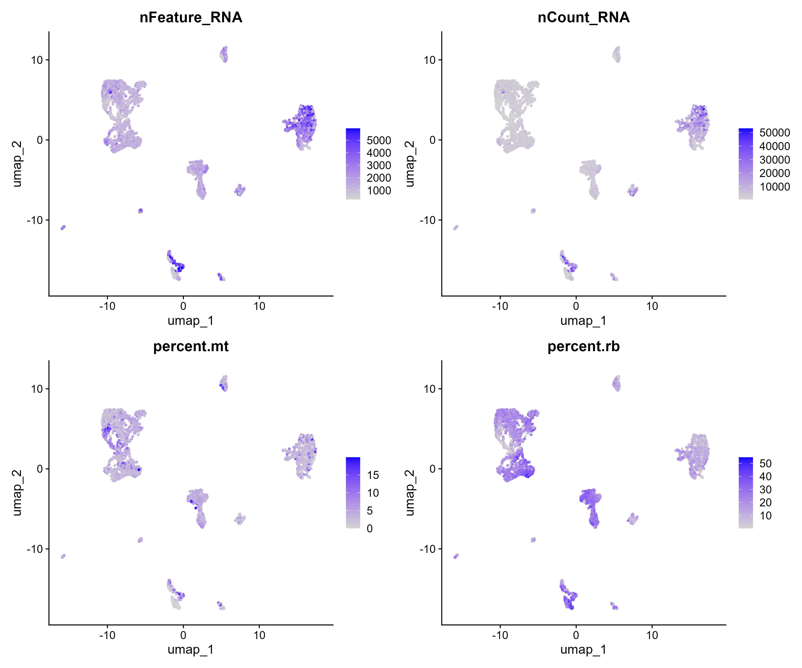

### 🫁 scRNA-seq Analysis: 3k Human Squamous Cell Lung Carcinoma Disseminated Tumor Cells (DTCs) (Demonstration Project)

  

End-to-end single-cell RNA-seq analysis pipeline for the **3k Human Squamous Cell Lung Carcinoma DTC** dataset (10x Chromium 5' v2), built with [Seurat v5](https://satijalab.org/seurat/) and standard Bioconductor tools.
This repository contains a **demonstration workflow for single-cell RNA sequencing (scRNA-seq) analysis** using a publicly available dataset of Stage III squamous cell lung carcinoma (NSCLC) tumor cells.

> ⚠️ **Disclaimer:**  
> This project is intended **for educational and demonstration purposes only**. It is not a clinical study and does not claim any novel biological discovery.

---

### 🧬 Dataset Overview

#### 🫁 Biological context
- Disease: Non-small cell lung cancer (NSCLC)
- Subtype: Squamous cell carcinoma
- Stage: III
- Sample type: Dissociated tumor cells (DTCs)
- Species: Human
- Tissue: Lung
- Preservation: Cryopreserved

---

#### 🔬 Single-cell RNA-seq data

- Platform: 10x Genomics Chromium X
- Chemistry: 5' Gene Expression (v2)
- Input cells: ~4,000
- Recovered cells: 2,616
- Sequencing depth: ~25,000 reads per cell

---


#### Repository Structure
```
.
├── lung_dtc_seurat_analysis.R          # Complete analysis script (Sections 1–23)
├── README.md
├── data/
│   ├── raw/                  # downloaded 10x files
└── output/
    ├── lung_dtc_seurat_final.rds       # Final Seurat object (all analyses embedded)
    ├── session_info.txt
    ├── figures/                        # All 46 publication-quality figures (.png, 300 dpi)
    │   ├── 00_SUMMARY_UMAP_panel.png
    │   ├── 01_QC_violin_before.png
    │   ├── ...
    │   └── 46_SCC_markers_dotplot.png
    └── tables/                         # CSV exports
        ├── 01_all_cluster_markers.csv
        ├── 02_top10_markers_per_cluster.csv
        ├── 03_celltype_counts.csv
        ├── 04_cluster_celltype_composition.csv
        ├── 05_proliferation_per_cluster.csv
        ├── 06_tumor_subclone_markers.csv
        └── 07_full_cell_metadata.csv
```

---

#### ⚙️ Pipeline Overview
This repository demonstrates a **standard scRNA-seq analysis pipeline**, including:
#### 1. Download input files, Environment Setup & Package Installation
📦 Input Data: Only processed 10x Genomics gene expression data is used:
- `filtered_feature_bc_matrix.h5` (preferred)
OR
- `filtered_feature_bc_matrix/` directory

📦 Install all required CRAN, Bioconductor, and GitHub packages. Includes Seurat v5, SCTransform, SingleR, AUCell, ComplexHeatmap, and msigdbr.

#### 2. Load Libraries
Load all libraries needed for the full pipeline.

#### 3. Load Data & Create Seurat Object
Read the filtered HDF5 file with `Read10X_h5()` and initialise a Seurat object. Genes expressed in fewer than 3 cells and cells with fewer than 200 detected genes are discarded at this stage.

#### 4. Quality Control
Compute mitochondrial % (`percent.mt`), ribosomal % (`percent.rb`), and
log10 UMI counts. Visualise with violin plots and scatter plots before and
after filtering. Apply tumor-appropriate thresholds:
`nFeature_RNA` 200–6,000, `percent.mt` < 20%.

#### 5. Normalization — SCTransform
`SCTransform(vst.flavor = "v2", vars.to.regress = "percent.mt")` replaces
`NormalizeData + FindVariableFeatures + ScaleData`. Corrects for sequencing
depth and mitochondrial contamination simultaneously.
#### 6. Dimensionality Reduction — PCA
Run PCA on SCT variable features (50 components). Elbow plot to select
optimal number of PCs. Inspect loadings with `VizDimLoadings` and
`DimHeatmap`.

#### 7. Clustering
KNN graph (`FindNeighbors`, `dims = 1:25`). Leiden/Louvain clustering tested at resolutions 0.3, 0.5, 0.8. Working resolution: 0.5.

#### 8. UMAP + t-SNE
Both 2D embeddings generated. QC metrics overlaid on UMAP to flag low-quality clusters.

#### 9. Marker Gene Identification
`FindAllMarkers` (SCT assay, Wilcoxon, `only.pos = TRUE`). Top 10 markers per cluster exported. Heatmap and dot plot generated.

#### 10. Canonical Marker Panels
13-panel marker set covering SCC Tumor, EMT, T cells (CD4/CD8/Treg), NK, Bcells, Myeloid, M2 Macrophage, Dendritic Cells, CAF, and Endothelial cells.
Dot plot and UMAP feature plots generated.

#### 11. Cell Type Annotation — SingleR
Two reference datasets: Blueprint/ENCODE (immune-focused) and Human
Primary Cell Atlas (broad coverage). Consensus annotation created.
Annotation score heatmaps generated. Cluster × CellType composition table
exported.
#### 12. Tumor vs TME Classification
Each cell classified as `Tumor_Epithelial`, `Immune_TME`, `Stromal_TME`, or
`Unassigned` using SingleR consensus labels and EPCAM expression. UMAP
coloured by broad class.
#### 13. EMT Analysis (Q3)
Epithelial and mesenchymal program scores computed with `AddModuleScore`.
EMT Index = Mesenchymal Score − Epithelial Score. Scatter plot reveals the
epithelial–mesenchymal continuum. Violin plot shows EMT distribution per
cluster. Key EMT genes plotted on UMAP.
#### 14. Proliferation Analysis (Q4)
Cell cycle scoring with `CellCycleScoring` using Seurat's built-in S and
G2/M gene sets. UMAP coloured by phase. Proliferation markers (MKI67,
TOP2A, PCNA) visualised. Fraction of proliferating cells per cluster
exported.
#### 15. Immune Contexture Analysis (Q5)
Immune cells subsetted and re-clustered independently. UMAP and feature
plots generated for key immune subtypes: CD8 T, CD4 T, Treg, NK, B cells,
Myeloid.
#### 16. Immunotherapy Target Analysis (Q6)
Four-panel checkpoint analysis: (1) T cell exhaustion markers (PDCD1/PD-1,
HAVCR2/TIM-3, TIGIT, LAG3, CTLA4, TOX), (2) Checkpoint ligands (CD274/PD-L1,
PDCD1LG2, LGALS9, CD155), (3) Cytotoxic effectors (GZMB, PRF1, IFNG), (4)
Treg / immunosuppression (FOXP3, IL10, TGFB1). PD-L1 high cells quantified
and mapped.
#### 17. Tumor Subclone Analysis (Q2)
Tumor epithelial cells isolated and independently re-processed (SCTransform,
PCA, clustering, UMAP). Subclone-specific markers identified. EMT index and
cell cycle phase overlaid on subclone UMAP.
#### 18. AUCell Gene Set Scoring
Ten biologically motivated gene sets scored per cell using AUCell: SCC
Tumor, EMT, Proliferation, Hypoxia, Immune Evasion, Cytotoxic T, T
Exhaustion, M2 Macrophage, CAF, Angiogenesis. Dominant program assigned per
cell. Heatmap of mean AUC per cluster generated.
#### 19. MSigDB Hallmark Pathway Scoring
All 50 Hallmark pathways downloaded via `msigdbr` and scored with AUCell.
Twelve cancer-relevant pathways visualised: EMT, Hypoxia, IFN-γ Response,
MYC Targets, G2M Checkpoint, TNFα–NFκB, IL6–JAK–STAT3, Inflammatory
Response, Oxidative Phosphorylation, PI3K–AKT–mTOR, UPR, Apoptosis.
#### 20. Stromal Analysis (Q8)
CAF, myofibroblast, endothelial, and pericyte marker panels visualised.
Angiogenesis markers (VEGFA, KDR, FLT1) mapped on UMAP.
#### 21. SCC-Specific Markers
Lung squamous cell carcinoma lineage markers: TP63, SOX2, KRT5, KRT14,
FGFR1, EGFR, MMP family (invasion), S100A4 (metastasis promoter).
#### 22. Summary Figure Panel
Publication-ready 2×2 UMAP panel: clusters, cell type annotation, tumor vs
TME, cell cycle phase.
#### 23. Save Results
Seurat object saved as `.rds`. All metadata exported as CSV.
`sessionInfo()` written for reproducibility.

---


#### Requirements

**R ≥ 4.3.0**

| Package | Source | Purpose |
|---|---|---|
| Seurat ≥ 5.0 | CRAN | Core single-cell framework |
| SeuratObject | CRAN | Seurat S4 object |
| sctransform | CRAN | SCTransform normalisation |
| BPCells | r-universe | High-performance matrix ops |
| presto | r-universe | Fast Wilcoxon DE test |
| glmGamPoi | r-universe | GLM for SCTransform |
| SingleR | Bioconductor | Automated annotation |
| celldex | Bioconductor | Reference datasets for SingleR |
| AUCell | Bioconductor | Gene set activity scoring |
| ComplexHeatmap | Bioconductor | Heatmap visualisation |
| SingleCellExperiment | Bioconductor | SCE container |
| msigdbr | CRAN | MSigDB gene sets |
| GSEABase | Bioconductor | Gene set objects |
| ggplot2 | CRAN | Plotting |
| patchwork | CRAN | Plot composition |
| dplyr | CRAN | Data wrangling |
| viridis | CRAN | Colour palettes |

---

#### Quick Start

```r
# 1. Clone the repository
# git clone https://github.com/<your-username>/lung-dtc-scrna.git

# 2. Place the input HDF5 file in the project root:
#    SC5pv2_GEX_Human_Lung_Carcinoma_DTC_filtered_feature_bc_matrix.h5

# 3. Open analysis.R and run from top to bottom (or source it):
source("analysis.R")

# Outputs will appear in output/ and output/images/
```

#### Research Questions Addressed in this dataset
```
#   Q1. What cell populations exist in this DTC sample?
#       (Tumor cells vs Tumor Microenvironment)
#   Q2. Is there intra-tumor heterogeneity?
#       (Tumor subclones with distinct gene programs)
#   Q3. Which tumor cells are undergoing EMT / metastatic transition?
#   Q4. Are there proliferating tumor cell subpopulations?
#   Q5. What is the immune contexture of this DTC sample?
#       (T cell subtypes, exhaustion status, NK, B, Myeloid)
#   Q6. Are checkpoint / immunotherapy target genes expressed?
#       (PD-1/PD-L1, CTLA-4, TIM-3, LAG-3, TIGIT)
#   Q7. What cancer hallmark pathways are active per cell type?
#       (Hypoxia, MYC, G2M, TNFa-NFkB, IFN-gamma)
#   Q8. What stromal populations support the tumor?
#       (Cancer-associated fibroblasts, Endothelial cells)

```

#### SECTION 1: INSTALL PACKAGES
```
install.packages("BiocManager")
BiocManager::install(
  c("ComplexHeatmap", "celldex", "SingleR", "AUCell",
    "SingleCellExperiment", "GSEABase", "BiocFileCache"),
  ask = FALSE, update = FALSE
)

install.packages(c(
  "Seurat", "SeuratObject", "ggplot2", "ggrepel",
  "RColorBrewer", "patchwork", "dplyr", "tibble",
  "viridis", "pheatmap", "msigdbr", "gridExtra",
  "scales", "ggridges", "cowplot"
))

setRepositories(ind = 1:3, addURLs = c(
  'https://satijalab.r-universe.dev',
  'https://bnprks.r-universe.dev/'
))
install.packages(c("BPCells", "presto", "glmGamPoi"))

if (!requireNamespace("remotes", quietly = TRUE)) install.packages("remotes")
remotes::install_github("satijalab/seurat-data",     quiet = TRUE)
remotes::install_github("satijalab/azimuth",         quiet = TRUE)
remotes::install_github("satijalab/seurat-wrappers", quiet = TRUE)
```
#### SECTION 2: LOAD LIBRARIES
```
library(Seurat)
library(SeuratObject)
library(ggplot2)
library(ggrepel)
library(RColorBrewer)
library(patchwork)
library(dplyr)
library(tibble)
library(BPCells)
library(presto)
library(glmGamPoi)
library(ComplexHeatmap)
library(SingleCellExperiment)
library(SingleR)
library(viridis)
library(celldex)
library(AUCell)
library(pheatmap)
library(msigdbr)
library(GSEABase)
library(gridExtra)
library(scales)
library(cowplot)

```
```
# ── Output directories ────────────────────────────────────────────────────────
dir.create("output",               showWarnings = FALSE)
dir.create("output/figures",       showWarnings = FALSE)
dir.create("output/tables",        showWarnings = FALSE)

set.seed(42)   # reproducibility

cat("=== Lung Carcinoma DTC Analysis — Seurat v5 ===\n")
cat("Seurat version:", as.character(packageVersion("Seurat")), "\n\n")

```

#### SECTION 3: LOAD DATA
```
data <- Read10X_h5(
  "SC5pv2_GEX_Human_Lung_Carcinoma_DTC_filtered_feature_bc_matrix.h5"
)

# Create Seurat object
# min.cells = 3   : remove genes detected in < 3 cells (noise reduction)
# min.features = 200 : remove empty droplets / debris
lung <- CreateSeuratObject(
  counts       = data,
  project      = "LungCarcinomaDTC",
  min.cells    = 3,
  min.features = 200
)

cat("Initial object:\n")
print(lung)
```
##### Output: 21542 features across 2521 samples within 1 assay, Active assay: RNA (21542 features, 0 variable features), 1 layer present: counts


#### SECTION 4: QUALITY CONTROL
 NOTE — Tumor-specific QC thresholds:
 Threshold         PBMC (healthy)    Lung Carcinoma DTC
 nFeature_RNA max  2,500             6,000–8,000
 percent.mt max    5%                20%

Reasons:
• Carcinoma cells are large and transcriptionally complex → more genes/UMIs
• DTCs under metastatic stress → elevated mitochondrial activity is expected
• Chromium X has higher sensitivity → genuine cells may have higher counts
Applying PBMC thresholds would DISCARD real tumor cells.
Here what are we questioning?
| Metric          | Role                           |
| --------------- | ------------------------------ |
| UMI count       | “how much RNA did we capture?” |
| % mitochondrial | “is the cell dying?”           |
| gene count      | “how complex is the cell?”     |
| ribosomal %     | “is protein machinery active?” |

```
# ── Compute QC metrics ────────────────────────────────────────────────────────

# Mitochondrial genes — marker of cellular stress / apoptosis
lung[["percent.mt"]] <- PercentageFeatureSet(lung, pattern = "^MT-")

# Ribosomal genes — high % can indicate transcriptionally biased cells
lung[["percent.rb"]] <- PercentageFeatureSet(lung, pattern = "^RP[SL]")

# Log10 of total UMIs — useful for outlier detection on log scale
lung[["log10_nCount"]] <- log10(lung$nCount_RNA + 1)

cat("QC summary before filtering:\n")
print(summary(lung@meta.data[, c("nFeature_RNA", "nCount_RNA",
                                  "percent.mt", "percent.rb")]))
```
##### Output: Cells before QC: 2521

```
# ── Visualize before filtering ────────────────────────────────────────────────

p_qc1 <- VlnPlot(
  lung,
  features = c("nFeature_RNA", "nCount_RNA", "percent.mt", "percent.rb"),
  ncol = 4, pt.size = 0.1
) + plot_annotation(title = "QC Metrics — Before Filtering")

ggsave("output/figures/01_QC_violin_before.png",
       p_qc1, width = 18, height = 5, dpi = 300)
```

*Figure 1. Distribution of gene counts, UMI counts, mitochondrial and ribosomal percentages before QC filtering.*


```
p_scatter1 <- FeatureScatter(lung, "nCount_RNA", "percent.mt") +
  geom_hline(yintercept = 20, linetype = "dashed", color = "red") +
  ggtitle("UMI vs Mitochondrial %")

p_scatter2 <- FeatureScatter(lung, "nCount_RNA", "nFeature_RNA") +
  geom_hline(yintercept = c(200, 6000), linetype = "dashed", color = "red") +
  ggtitle("UMI vs Gene Count")

p_scatter3 <- FeatureScatter(lung, "nCount_RNA", "percent.rb") +
  ggtitle("UMI vs Ribosomal %")

ggsave("output/figures/02_QC_scatter_before.png",
       p_scatter1 + p_scatter2 + p_scatter3,
       width = 18, height = 5, dpi = 300)
```

*Figure 1. Scatter plot before QC filtering.*

```
# ── Filter cells ──────────────────────────────────────────────────────────────

cat(sprintf("Cells before QC: %d\n", ncol(lung)))

lung <- subset(
  lung,
  subset = nFeature_RNA > 200   &   # remove empty droplets
           nFeature_RNA < 6000  &   # remove doublets
           percent.mt   < 20        # remove dying / debris cells
)

cat(sprintf("Cells after QC:  %d\n", ncol(lung)))
cat(sprintf("Genes retained:  %d\n", nrow(lung)))

```
##### Output: 
Cells after QC:  2387
Genes retained:  21542

```
# ── Visualize after filtering ─────────────────────────────────────────────────

p_qc2 <- VlnPlot(
  lung,
  features = c("nFeature_RNA", "nCount_RNA", "percent.mt", "percent.rb"),
  ncol = 4, pt.size = 0.1
) + plot_annotation(title = "QC Metrics — After Filtering")

ggsave("output/figures/03_QC_violin_after.png",
       p_qc2, width = 18, height = 5, dpi = 300)
```

*Figure 1. Distribution of gene counts, UMI counts, mitochondrial and ribosomal percentages after filtering.*
```

#### SECTION 5: NORMALIZATION — SCTransform

```
# SCTransform:
#  • Replaces NormalizeData + FindVariableFeatures + ScaleData
#  • Uses a regularized negative binomial regression to model UMI counts
#  • Automatically corrects for sequencing depth differences
#  • vars.to.regress = "percent.mt" removes mitochondrial contamination signal

lung <- SCTransform(
  lung,
  vars.to.regress = "percent.mt",
  vst.flavor      = "v2",           # recommended for Seurat v5
  verbose         = FALSE
)

cat("SCTransform complete.\n")
cat("Variable features (top 10):", head(VariableFeatures(lung), 10), "\n\n")
```
```
# Plot highly variable features
p_hvg <- VariableFeaturePlot(lung)
p_hvg <- LabelPoints(
  plot   = p_hvg,
  points = head(VariableFeatures(lung), 20),
  repel  = TRUE
)
ggsave("output/figures/04_variable_features.png",
       p_hvg, width = 10, height = 6, dpi = 300)
```

<p align="center">
  
</p>

<p align="center">
  <em>Figure 4. Highly variable genes used for downstream analysis.</em>
</p>

```
# ─────────────────────────────────────────────────────────────────────────────
# SECTION 6: DIMENSIONALITY REDUCTION — PCA
# ─────────────────────────────────────────────────────────────────────────────

lung <- RunPCA(lung, features = VariableFeatures(lung), npcs = 50)

# Elbow plot — identify how many PCs capture meaningful biological signal
# Look for the "elbow" where variance drops sharply
p_elbow <- ElbowPlot(lung, ndims = 40) +
  geom_vline(xintercept = 25, linetype = "dashed", color = "red") +
  ggtitle("Elbow Plot — Variance Explained per PC\n(red line = suggested cutoff)")
ggsave("output/figures/05_elbow_plot.png",
       p_elbow, width = 8, height = 5, dpi = 300)
```
<p align="center">
  
</p>

<p align="center">
  <em>Figure 5. PCA elbow plot used to select the number of principal components.</em>
</p>

```
# Top gene loadings per PC
print(lung[["pca"]], dims = 1:5, nfeatures = 5)
```

### PCA Loadings Summary

| PC | Positive Markers | Negative Markers |
|----|------------------|------------------|
| PC1 | FTL, TYROBP, IFI30, APOE, C1QA | CCL5, CD7, GZMB, IL32, CD3E |
| PC2 | KRT19, KRT6A, FXYD3, KRT5, S100A2 | CCL5, CD74, HLA-DRA, C1QB, C1QA |
| PC3 | CCL5, GZMB, CD7, CD8A, GZMA | HSPA1A, CD74, MS4A1, CD79A, HSPA1B |
| PC4 | CLU, IFITM3, TPSAB1, TPSB2, BACE2 | CD74, HLA-DRA, MS4A1, CD79A, BANK1 |
| PC5 | HSPA1A, HSPA1B, DNAJB1, HSPA6, RNASE1 | TPSAB1, CPA3, TPSB2, SLC24A3, HDC |

```
p_pca_load <- VizDimLoadings(lung, dims = 1:4, reduction = "pca")
ggsave("output/figures/06_PCA_loadings.png",
       p_pca_load, width = 12, height = 11, dpi = 300)
```
<p align="center">
  
</p>

<p align="center">
  <em>Figure 6. PCA loadings highlighting genes driving principal component variation.</em>
</p>

```
p_pca_scatter <- DimPlot(lung, reduction = "pca") +
  ggtitle("PCA — All Cells")
ggsave("output/figures/07_PCA_scatter.png",
       p_pca_scatter, width = 8, height = 6, dpi = 300)

```
<p align="center">
  
</p>

<p align="center">
  <em>Figure 7. PCA projection of cells showing global transcriptional variation.</em>
</p>
```
# Dimensional heatmaps — which genes drive each PC
p_pca_heatmap <- DimHeatmap(
  lung,
  dims = 1:9,        # better for readability (you can keep 1:15 if you want)
  cells = 500,
  balanced = TRUE 
# Save the plot
ggsave(
  filename = "output/figures/08_PCA_driver_genes.png",
  plot     = p_pca_heatmap,
  width    = 12,
  height   = 10,
  dpi      = 300
)
```
<p align="center">
  
</p>

<p align="center">
  <em>Figure 8. Key genes driving principal components in the dataset.</em>
</p>

```
# ─────────────────────────────────────────────────────────────────────────────
# SECTION 7: CLUSTERING
# ─────────────────────────────────────────────────────────────────────────────
# n_dims = 25 chosen from elbow plot (tumor datasets need more PCs than PBMC
# because there is more biological complexity — subclones, TME heterogeneity)

N_DIMS <- 25   # adjust based on your elbow plot

lung <- FindNeighbors(lung, dims = 1:N_DIMS)

# Test multiple resolutions — tumor data often needs 0.3–0.8
lung <- FindClusters(lung, resolution = 0.3)
lung <- FindClusters(lung, resolution = 0.5)
lung <- FindClusters(lung, resolution = 0.8)

```
### Clustering Summary (Louvain Algorithm)

| Resolution | Nodes | Edges | Modularity | Communities (Clusters) |
|------------|-------|-------|------------|-------------------------|
| 0.3        | 2387  | 76120 | 0.9338     | 9                       |
| 0.5        | 2387  | 76120 | 0.9065     | 12                      |
| 0.8        | 2387  | 76120 | 0.8773     | 16                      |

### Interpretation
| Resolution | Clusters | Modularity | Interpretation |
| ---------- | -------- | ---------- | -------------- |
| 0.3        | 9        | 0.9338     | very coarse    |
| 0.5        | 12       | 0.9065     | balanced       |
| 0.8        | 16       | 0.8773     | fine-grained   |

**Interpretation:**  
- Lower resolution (0.3) produces fewer, broader clusters (coarse structure)  
- Higher resolution (0.8) increases granularity but may over-fragment biologically similar cells  
- Resolution **0.5** provides a balanced clustering and was selected for downstream analysis

Based on modularity and cluster granularity, resolution **0.5** was selected as it provides a balanced representation of tumor heterogeneity without over-fragmentation.


```
lung <- FindClusters(lung, resolution = 0.5)

cat("Clusters found (resolution 0.5):", length(levels(Idents(lung))), "\n")
cat("Cluster sizes:\n")
print(table(Idents(lung)))
```
### Output:
| Cluster | Cells |
|--------|------|
| 0 | 505 |
| 1 | 363 |
| 2 | 351 |
| 3 | 244 |
| 4 | 236 |
| 5 | 182 |
| 6 | 159 |
| 7 | 100 |
| 8 | 87 |
| 9 | 66 |
| 10 | 56 |
| 11 | 38 |

```

# ─────────────────────────────────────────────────────────────────────────────
# SECTION 8: UMAP + t-SNE
# ─────────────────────────────────────────────────────────────────────────────
lung <- RunUMAP(lung,  dims = 1:N_DIMS)
p_umap <- DimPlot(lung, reduction = "umap", label = TRUE,
                   repel = TRUE, label.size = 4) +
  ggtitle("UMAP — Leiden Clusters\n3k Lung Carcinoma DTCs") +
  theme(plot.title = element_text(hjust = 0.5, face = "bold"))
ggsave("output/figures/09_UMAP_clusters.png",
       p_umap, width = 9, height = 7, dpi = 300)

```
<p align="center">
  
</p>

<p align="center">
  <em>Figure 9. UMAP projection showing clustering of lung carcinoma cells.</em>
</p>

```
lung <- RunTSNE(lung,  dims = 1:N_DIMS, verbose = FALSE)
p_tsne <- DimPlot(lung, reduction = "tsne", label = TRUE,
                   repel = TRUE, label.size = 4) +
  ggtitle("t-SNE — Leiden Clusters\n3k Lung Carcinoma DTCs") +
  theme(plot.title = element_text(hjust = 0.5, face = "bold"))
ggsave("output/figures/10_tSNE_clusters.png",
       p_tsne, width = 9, height = 7, dpi = 300)
```
<p align="center">
  
</p>

<p align="center">
  <em>Figure 10. t-SNE projection of the dataset for comparison.</em>
</p>

```
# QC overlay on UMAP — flag any low-quality clusters
p_qc_umap <- FeaturePlot(
  lung,
  features  = c("nFeature_RNA", "nCount_RNA", "percent.mt", "percent.rb"),
  reduction = "umap", ncol = 2
)
ggsave("output/figures/11_UMAP_QC_overlay.png",
       p_qc_umap, width = 12, height = 10, dpi = 300)

```
This visualization helps identify low-quality clusters, potential doublets, or stressed cells by highlighting QC metrics across the embedding.
<p align="center">
  
</p>

<p align="center">
  <em>Figure 11. UMAP projection overlaid with QC metrics to assess cluster quality.</em>
</p>


```
# ─────────────────────────────────────────────────────────────────────────────
# SECTION 9: MARKER GENE IDENTIFICATION
# ─────────────────────────────────────────────────────────────────────────────

lung.markers <- FindAllMarkers(
  lung,
  only.pos        = TRUE,
  min.pct         = 0.25,
  logfc.threshold = 0.25,
  assay           = "SCT"
)

# Top 10 markers per cluster by log2FC
top10 <- lung.markers %>%
  group_by(cluster) %>%
  slice_max(order_by = avg_log2FC, n = 10) %>%
  ungroup()

write.csv(lung.markers, "output/tables/01_all_cluster_markers.csv",
          row.names = TRUE)
write.csv(top10, "output/tables/02_top10_markers_per_cluster.csv",
          row.names = FALSE)
cat("Marker genes saved.\n")
```
### Output
Cluster-specific marker genes were identified using differential expression analysis.
- 📄 [All cluster markers](output/tables/01_all_cluster_markers.csv)  
- 📄 [Top 10 markers per cluster](output/tables/02_top10_markers_per_cluster.csv)
These markers were used to interpret biological identities of clusters, including tumor epithelial cells, immune populations, and stromal components.

```
# Heatmap — top 5 per cluster
top5 <- lung.markers %>%
  group_by(cluster) %>%
  dplyr::filter(avg_log2FC > 1) %>%
  slice_head(n = 5) %>%
  ungroup()

p_heatmap <- DoHeatmap(lung, features = top5$gene, assay = "SCT") +
  NoLegend() +
  ggtitle("Top 5 Marker Genes per Cluster")
ggsave("output/figures/12_marker_heatmap.png",
       p_heatmap, width = 14, height = 10, dpi = 300)

# Dot plot of top 3 per cluster
top3 <- lung.markers %>%
  group_by(cluster) %>%
  slice_max(avg_log2FC, n = 3) %>%
  ungroup()

p_dot_markers <- DotPlot(lung, features = unique(top3$gene), assay = "SCT") +
  RotatedAxis() +
  ggtitle("Top Marker Genes — Dot Plot")
ggsave("output/figures/13_marker_dotplot.png",
       p_dot_markers, width = 16, height = 6, dpi = 300)


# ─────────────────────────────────────────────────────────────────────────────
# SECTION 10: CANONICAL MARKER PANELS
# ─────────────────────────────────────────────────────────────────────────────
# Q1: What cell populations exist? Tumor vs TME?
# These markers define the major cell types expected in a DTC sample

# ── Panel A: Cell type identity markers ───────────────────────────────────────
panel_identity <- list(

  # Squamous cell carcinoma — the primary tumor cell type
  "SCC Tumor"       = c("EPCAM", "KRT19", "KRT18", "KRT5", "KRT14",
                         "TP63", "SOX2", "FGFR1", "EGFR"),

  # Mesenchymal / EMT (epithelial → mesenchymal transition)
  "EMT / Mesenchymal" = c("VIM", "CDH2", "FN1", "SNAI1", "SNAI2",
                            "TWIST1", "ZEB1", "ZEB2"),

  # T cells — general
  "T cells"         = c("CD3D", "CD3E", "CD3G", "TRAC", "TRBC1"),

  # CD8 cytotoxic T cells
  "CD8 T cells"     = c("CD8A", "CD8B", "GZMB", "GZMK", "PRF1",
                         "IFNG", "NKG7"),

  # CD4 helper T cells
  "CD4 T cells"     = c("CD4", "IL7R", "CCR7", "LTB", "SELL"),

  # Regulatory T cells
  "Treg"            = c("FOXP3", "IL2RA", "CTLA4", "IKZF2"),

  # NK cells
  "NK cells"        = c("NKG7", "GNLY", "KLRD1", "NCR1", "NCAM1"),

  # B cells
  "B cells"         = c("MS4A1", "CD79A", "CD74", "IGHM"),

  # Monocytes / Macrophages
  "Myeloid"         = c("LYZ", "CD14", "FCGR3A", "S100A8", "S100A9",
                         "CST3", "CTSS"),

  # M2 / Immunosuppressive macrophages
  "M2 Macrophage"   = c("CD163", "MRC1", "IL10", "CCL18", "TGFB1"),

  # Dendritic cells
  "Dendritic cells" = c("FCER1A", "CST3", "IL3RA", "CLEC4C"),

  # Cancer-associated fibroblasts
  "CAF"             = c("COL1A1", "COL3A1", "FAP", "ACTA2",
                         "PDGFRA", "THY1"),

  # Endothelial cells
  "Endothelial"     = c("PECAM1", "VWF", "CDH5", "ENG", "CLDN5")
)

# ── Panel A: Cell type identity markers ───────────────────────────────────────
panel_identity <- list(
  
  # Squamous cell carcinoma — the primary tumor cell type
  "SCC Tumor"       = c("EPCAM", "KRT19", "KRT18", "KRT5", "KRT14",
                        "TP63", "SOX2", "FGFR1", "EGFR"),
  
  # Mesenchymal / EMT (epithelial → mesenchymal transition)
  "EMT / Mesenchymal" = c("VIM", "CDH2", "FN1", "SNAI1", "SNAI2",
                          "TWIST1", "ZEB1", "ZEB2"),
  
  # T cells — general
  "T cells"         = c("CD3D", "CD3E", "CD3G", "TRAC", "TRBC1"),
  
  # CD8 cytotoxic T cells
  "CD8 T cells"     = c("CD8A", "CD8B", "GZMB", "GZMK", "PRF1",
                        "IFNG", "NKG7"),
  
  # CD4 helper T cells
  "CD4 T cells"     = c("CD4", "IL7R", "CCR7", "LTB", "SELL"),
  
  # Regulatory T cells
  "Treg"            = c("FOXP3", "IL2RA", "CTLA4", "IKZF2"),
  
  # NK cells
  "NK cells"        = c("NKG7", "GNLY", "KLRD1", "NCR1", "NCAM1"),
  
  # B cells
  "B cells"         = c("MS4A1", "CD79A", "CD74", "IGHM"),
  
  # Monocytes / Macrophages
  "Myeloid"         = c("LYZ", "CD14", "FCGR3A", "S100A8", "S100A9",
                        "CST3", "CTSS"),
  
  # M2 / Immunosuppressive macrophages
  "M2 Macrophage"   = c("CD163", "MRC1", "IL10", "CCL18", "TGFB1"),
  
  # Dendritic cells
  "Dendritic cells" = c("FCER1A", "CST3", "IL3RA", "CLEC4C"),
  
  # Cancer-associated fibroblasts
  "CAF"             = c("COL1A1", "COL3A1", "FAP", "ACTA2",
                        "PDGFRA", "THY1"),
  
  # Endothelial cells
  "Endothelial"     = c("PECAM1", "VWF", "CDH5", "ENG", "CLDN5")
)

# Filter to genes present in the dataset
panel_identity_present <- lapply(panel_identity, function(genes) {
  intersect(genes, rownames(lung))
})
panel_identity_present <- Filter(function(x) length(x) > 0,
                                 panel_identity_present)

# DotPlot — % expressing + average expression
genes_all <- unique(unlist(panel_identity_present))
p_id_dot <- DotPlot(
  lung,
  features = genes_all,
  assay = "SCT"
) +
  RotatedAxis() +
  scale_color_gradient2(low = "blue", mid = "white", high = "red") +
  ggtitle("Cell Identity Marker Panel — All Clusters") +
  theme(axis.text.x = element_text(size = 7))
ggsave(
  "output/figures/14_cell_identity_dotplot.png",
  p_id_dot,
  width = 16,
  height = 8,
  dpi = 300
)
p1 <- DotPlot(lung, features = panel_identity_present$`SCC Tumor`) +
  RotatedAxis() + ggtitle("Tumor Markers")

p2 <- DotPlot(lung, features = panel_identity_present$`T cells`) +
  RotatedAxis() + ggtitle("T Cells")

p3 <- DotPlot(lung, features = panel_identity_present$Myeloid) +
  RotatedAxis() + ggtitle("Myeloid Cells")

p4 <- DotPlot(lung, features = panel_identity_present$CAF) +
  RotatedAxis() + ggtitle("Fibroblasts / CAFs")

ggsave("output/figures/14atumor_markers.png", p1, width = 10, height = 6)
ggsave("output/figures/14btcell_markers.png", p2, width = 10, height = 6)
ggsave("output/figures/14cmyeloid_markers.png", p3, width = 10, height = 6)
ggsave("output/figures/14dcaf_markers.png", width = 10, height = 6)
# UMAP feature plots for key markers
key_markers <- c("EPCAM", "KRT19", "VIM", "CDH2",
                  "CD3D", "CD8A", "NKG7", "MS4A1",
                  "LYZ", "CD163", "COL1A1", "PECAM1")
key_markers <- intersect(key_markers, rownames(lung))

p_feature_key <- FeaturePlot(lung, features = key_markers,
                              reduction = "umap", ncol = 4,
                              min.cutoff = "q10", max.cutoff = "q90")
ggsave("output/figures/15_key_markers_featureplot.png",
       p_feature_key, width = 20, height = 10, dpi = 300)


# ─────────────────────────────────────────────────────────────────────────────
# SECTION 11: CELL TYPE ANNOTATION — SingleR
# ─────────────────────────────────────────────────────────────────────────────
| Reference        | Purpose                       |
| ---------------- | ----------------------------- |
| Blueprint/ENCODE | immune + blood + some stromal |
| HPCA             | broad human primary tissues   |

# Load reference datasets
ref_blueprint <- celldex::BlueprintEncodeData()    # immune-focused
ref_hpca      <- celldex::HumanPrimaryCellAtlasData() # broad coverage

# Convert to SingleCellExperiment
sce_lung <- as.SingleCellExperiment(lung)

# Annotate with Blueprint/ENCODE
singleR_bp <- SingleR(
  test            = sce_lung,
  assay.type.test = 1,
  ref             = ref_blueprint,
  labels          = ref_blueprint$label.main
)

# Annotate with HPCA
singleR_hpca <- SingleR(
  test            = sce_lung,
  assay.type.test = 1,
  ref             = ref_hpca,
  labels          = ref_hpca$label.main
)

# Consensus: Blueprint where confident, HPCA as fallback
results_consensus <- ifelse(
  !is.na(singleR_bp$pruned.labels),
  singleR_bp$pruned.labels,
  singleR_hpca$pruned.labels
)

# Add to metadata
lung@meta.data$celltype_blueprint <- singleR_bp$pruned.labels
lung@meta.data$celltype_hpca      <- singleR_hpca$pruned.labels
lung@meta.data$celltype_consensus  <- results_consensus

cat("Cell type distribution (consensus):\n")
print(table(lung@meta.data$celltype_consensus))

# Save annotation table
write.csv(
  as.data.frame(table(lung@meta.data$celltype_consensus)),
  "output/tables/03_celltype_counts.csv",
  row.names = FALSE
)

# UMAP by annotation
p_annot <- DimPlot(lung, reduction = "umap",
                    group.by = "celltype_consensus",
                    label = TRUE, repel = TRUE, label.size = 3) +
  ggtitle("Cell Type Annotation (SingleR Consensus)") +
  theme(legend.text = element_text(size = 8))
ggsave("output/figures/16_UMAP_SingleR_consensus.png",
       p_annot, width = 12, height = 8, dpi = 300)

# Score heatmaps
png("output/figures/17_SingleR_scores_blueprint.png",
    width = 2400, height = 1600, res = 200)
plotScoreHeatmap(singleR_bp,
                 main = "SingleR Annotation Scores — Blueprint/ENCODE")
dev.off()

png("output/figures/18_SingleR_scores_hpca.png",
    width = 2400, height = 1600, res = 200)
plotScoreHeatmap(singleR_hpca,
                 main = "SingleR Annotation Scores — HPCA")
dev.off()

# Cluster × CellType composition table
comp_table <- table(
  Cluster  = Idents(lung),
  CellType = lung$celltype_consensus
)
write.csv(as.data.frame.matrix(comp_table),
          "output/tables/04_cluster_celltype_composition.csv")


# ─────────────────────────────────────────────────────────────────────────────
# SECTION 12: TUMOR vs TME CLASSIFICATION
# ─────────────────────────────────────────────────────────────────────────────
# Q1 answer: classify each cell as Tumor, Immune, or Stromal

lung@meta.data$broad_class <- dplyr::case_when(
  grepl("Epithelial|epithelial|Keratinocyte|keratinocyte",
        lung$celltype_consensus, ignore.case = TRUE)           ~ "Tumor_Epithelial",
  grepl("T_cell|T cell|NK|B_cell|B cell|Mono|DC|Myeloid|Neutro|Macro",
        lung$celltype_consensus, ignore.case = TRUE)           ~ "Immune_TME",
  grepl("Fibro|Endoth|Smooth|Pericyte|Stroma",
        lung$celltype_consensus, ignore.case = TRUE)           ~ "Stromal_TME",
  TRUE                                                          ~ "Unassigned"
)

# Manually refine based on EPCAM expression (more reliable than reference)
# Cells with EPCAM SCT expression > 1 are very likely tumor epithelial
epcam_expr <- FetchData(lung, vars = "EPCAM", assay = "SCT")
lung@meta.data$broad_class[epcam_expr$EPCAM > 1] <- "Tumor_Epithelial"

cat("\nBroad class distribution:\n")
print(table(lung$broad_class))

p_broad <- DimPlot(lung, reduction = "umap",
                    group.by = "broad_class",
                    cols = c("Tumor_Epithelial" = "#E41A1C",
                             "Immune_TME"        = "#377EB8",
                             "Stromal_TME"       = "#4DAF4A",
                             "Unassigned"        = "#999999"),
                    label = FALSE, pt.size = 0.6) +
  ggtitle("Tumor vs Tumor Microenvironment (TME)") +
  theme(plot.title = element_text(hjust = 0.5, face = "bold"))
ggsave("output/figures/19_UMAP_tumor_vs_TME.png",
       p_broad, width = 10, height = 7, dpi = 300)


# ─────────────────────────────────────────────────────────────────────────────
# SECTION 13: EMT ANALYSIS
# ─────────────────────────────────────────────────────────────────────────────
# Q3: Which tumor cells are undergoing EMT / metastatic transition?
# EMT = Epithelial-to-Mesenchymal Transition
# Key for DTCs: cells that have undergone (partial) EMT gain migratory capacity
# Spectrum: Epithelial ←→ Hybrid E/M ←→ Mesenchymal

# Epithelial score genes
emt_epithelial_genes <- c("EPCAM", "CDH1", "KRT19", "KRT18",
                           "KRT8", "CLDN3", "CLDN4", "MUC1")

# Mesenchymal score genes
emt_mesenchymal_genes <- c("VIM", "CDH2", "FN1", "SNAI1", "SNAI2",
                            "TWIST1", "ZEB1", "ZEB2", "FOXC2")

# Filter to present genes
emt_epi_present  <- intersect(emt_epithelial_genes,  rownames(lung))
emt_mes_present  <- intersect(emt_mesenchymal_genes, rownames(lung))

# Add module scores (Seurat scores each cell for the gene set)
lung <- AddModuleScore(lung, features = list(emt_epi_present),
                        name = "EMT_Epithelial_Score", assay = "SCT")
lung <- AddModuleScore(lung, features = list(emt_mes_present),
                        name = "EMT_Mesenchymal_Score", assay = "SCT")

# Rename columns (AddModuleScore appends a 1)
lung$EMT_Epithelial_Score  <- lung$EMT_Epithelial_Score1
lung$EMT_Mesenchymal_Score <- lung$EMT_Mesenchymal_Score1

# EMT index: positive = mesenchymal bias, negative = epithelial bias
lung$EMT_Index <- lung$EMT_Mesenchymal_Score - lung$EMT_Epithelial_Score

# Feature plots
p_emt1 <- FeaturePlot(lung, features = "EMT_Epithelial_Score",
                       reduction = "umap",
                       cols = c("grey90", "steelblue"),
                       min.cutoff = "q10") +
  ggtitle("Epithelial Score")

p_emt2 <- FeaturePlot(lung, features = "EMT_Mesenchymal_Score",
                       reduction = "umap",
                       cols = c("grey90", "firebrick"),
                       min.cutoff = "q10") +
  ggtitle("Mesenchymal Score")

p_emt3 <- FeaturePlot(lung, features = "EMT_Index",
                       reduction = "umap",
                       cols = c("steelblue", "white", "firebrick")) +
  ggtitle("EMT Index\n(blue=Epithelial, red=Mesenchymal)")

ggsave("output/figures/20_EMT_scores_UMAP.png",
       p_emt1 + p_emt2 + p_emt3, width = 18, height = 5, dpi = 300)

# EMT scatter: each dot = one cell
p_emt_scatter <- ggplot(lung@meta.data,
                          aes(x = EMT_Epithelial_Score,
                              y = EMT_Mesenchymal_Score,
                              color = broad_class)) +
  geom_point(size = 0.5, alpha = 0.7) +
  scale_color_manual(values = c("Tumor_Epithelial" = "#E41A1C",
                                 "Immune_TME"        = "#377EB8",
                                 "Stromal_TME"       = "#4DAF4A",
                                 "Unassigned"        = "#999999")) +
  theme_cowplot() +
  labs(title = "EMT Continuum: Epithelial vs Mesenchymal Score",
       x = "Epithelial Program Score",
       y = "Mesenchymal Program Score",
       color = "Cell Class") +
  theme(plot.title = element_text(hjust = 0.5, face = "bold"))
ggsave("output/figures/21_EMT_scatter.png",
       p_emt_scatter, width = 9, height = 7, dpi = 300)

# Violin: EMT index by cluster
p_emt_vln <- VlnPlot(lung, features = "EMT_Index",
                      pt.size = 0, group.by = "seurat_clusters") +
  geom_hline(yintercept = 0, linetype = "dashed") +
  ggtitle("EMT Index per Cluster\n(above 0 = mesenchymal bias)")
ggsave("output/figures/22_EMT_index_violin.png",
       p_emt_vln, width = 12, height = 5, dpi = 300)

# Key EMT genes on UMAP
emt_plot_genes <- c("EPCAM", "CDH1", "VIM", "CDH2",
                     "ZEB1", "SNAI1", "FN1", "TWIST1")
emt_plot_genes <- intersect(emt_plot_genes, rownames(lung))

p_emt_feat <- FeaturePlot(lung, features = emt_plot_genes,
                           reduction = "umap", ncol = 4,
                           min.cutoff = "q10", max.cutoff = "q90")
ggsave("output/figures/23_EMT_genes_featureplot.png",
       p_emt_feat, width = 20, height = 10, dpi = 300)


# ─────────────────────────────────────────────────────────────────────────────
# SECTION 14: PROLIFERATION ANALYSIS
# ─────────────────────────────────────────────────────────────────────────────
# Q4: Are there actively proliferating tumor subpopulations?
# Proliferating cells express S-phase and G2/M-phase markers
# Important for identifying aggressive tumor clones

# Cell cycle scoring using Seurat's built-in gene sets
s.genes   <- cc.genes$s.genes    # S-phase markers
g2m.genes <- cc.genes$g2m.genes  # G2/M-phase markers

lung <- CellCycleScoring(
  lung,
  s.features   = s.genes,
  g2m.features = g2m.genes,
  set.ident    = FALSE
)

cat("Cell cycle phase distribution:\n")
print(table(lung$Phase))

# UMAP by cell cycle phase
p_cc <- DimPlot(lung, reduction = "umap",
                  group.by = "Phase",
                  cols = c("G1" = "#4DAF4A", "S" = "#FF7F00", "G2M" = "#E41A1C"),
                  pt.size = 0.5) +
  ggtitle("Cell Cycle Phase")
ggsave("output/figures/24_UMAP_cell_cycle.png",
       p_cc, width = 9, height = 7, dpi = 300)

# S-score vs G2M-score scatter
p_cc_scatter <- ggplot(lung@meta.data,
                         aes(x = S.Score, y = G2M.Score,
                             color = Phase)) +
  geom_point(size = 0.6, alpha = 0.7) +
  scale_color_manual(values = c("G1" = "#4DAF4A",
                                 "S" = "#FF7F00",
                                 "G2M" = "#E41A1C")) +
  theme_cowplot() +
  labs(title = "Cell Cycle Score: S vs G2M",
       x = "S Phase Score", y = "G2M Phase Score") +
  theme(plot.title = element_text(hjust = 0.5, face = "bold"))
ggsave("output/figures/25_cell_cycle_scatter.png",
       p_cc_scatter, width = 8, height = 6, dpi = 300)

# Proliferation markers
prolif_genes <- c("MKI67", "TOP2A", "PCNA", "MCM2",
                   "CCNB1", "CDK1", "CENPF", "UBE2C")
prolif_genes <- intersect(prolif_genes, rownames(lung))

p_prolif <- FeaturePlot(lung, features = prolif_genes,
                         reduction = "umap", ncol = 4,
                         min.cutoff = "q10")
ggsave("output/figures/26_proliferation_markers.png",
       p_prolif, width = 20, height = 10, dpi = 300)

# Fraction of proliferating cells per cluster
prolif_table <- lung@meta.data %>%
  group_by(seurat_clusters) %>%
  summarise(
    n_cells        = n(),
    n_prolif       = sum(Phase %in% c("S", "G2M")),
    pct_prolif     = round(100 * n_prolif / n_cells, 1)
  )
write.csv(prolif_table, "output/tables/05_proliferation_per_cluster.csv",
          row.names = FALSE)

cat("Proliferation per cluster:\n")
print(prolif_table)


# ─────────────────────────────────────────────────────────────────────────────
# SECTION 15: IMMUNE CONTEXTURE ANALYSIS
# ─────────────────────────────────────────────────────────────────────────────
# Q5: What is the immune landscape of this DTC sample?

# ── Subset immune cells ────────────────────────────────────────────────────────
immune_idents <- grep(
  "T_cell|T cell|NK|B_cell|B cell|Mono|DC|Myeloid|Neutro|Macro|Plasma",
  levels(factor(lung$celltype_consensus)),
  value = TRUE, ignore.case = TRUE
)

if (length(immune_idents) > 0) {
  immune <- subset(lung, subset = celltype_consensus %in% immune_idents)
  cat(sprintf("Immune cells: %d\n", ncol(immune)))

  # Re-cluster immune compartment
  DefaultAssay(immune) <- "RNA"
  immune <- SCTransform(immune, vars.to.regress = "percent.mt",
                         verbose = FALSE)
  immune <- RunPCA(immune)
  immune <- FindNeighbors(immune, dims = 1:15)
  immune <- FindClusters(immune,  resolution = 0.5)
  immune <- RunUMAP(immune, dims = 1:15)

  p_immune <- DimPlot(immune, reduction = "umap",
                       group.by = "celltype_consensus",
                       label = TRUE, repel = TRUE) +
    ggtitle("Immune Cell Subclusters")
  ggsave("output/figures/27_immune_UMAP.png",
         p_immune, width = 11, height = 7, dpi = 300)

  # Immune subtype markers
  immune_markers_plot <- c(
    "CD3D", "CD8A", "CD4", "FOXP3",   # T cell subtypes
    "NKG7", "GNLY",                    # NK
    "MS4A1", "CD79A",                  # B cells
    "LYZ", "CD163", "CD14"            # Myeloid
  )
  immune_markers_plot <- intersect(immune_markers_plot, rownames(immune))

  p_immune_feat <- FeaturePlot(immune, features = immune_markers_plot,
                                reduction = "umap", ncol = 4,
                                min.cutoff = "q10")
  ggsave("output/figures/28_immune_markers_featureplot.png",
         p_immune_feat, width = 20, height = 10, dpi = 300)
}


# ─────────────────────────────────────────────────────────────────────────────
# SECTION 16: IMMUNOTHERAPY TARGET ANALYSIS
# ─────────────────────────────────────────────────────────────────────────────
# Q6: Are checkpoint / immunotherapy target genes expressed?
# Critical for predicting response to PD-1/PD-L1 blockade (pembrolizumab,
# nivolumab, atezolizumab) — standard of care in lung squamous cell carcinoma

panel_checkpoint <- list(

  # Inhibitory receptors on T cells (exhaustion markers)
  "T cell exhaustion" = c("PDCD1",    # PD-1  → target of pembrolizumab/nivolumab
                           "HAVCR2",   # TIM-3 → target of cobolimab
                           "TIGIT",    # TIGIT → target of tiragolumab
                           "LAG3",     # LAG-3 → target of relatlimab
                           "CTLA4",    # CTLA-4 → target of ipilimumab
                           "TOX",      # master transcription factor of exhaustion
                           "ENTPD1",   # CD39 — exhaustion marker
                           "BATF"),    # drives exhaustion TF program

  # Ligands expressed by tumor / myeloid (target of atezolizumab/durvalumab)
  "Checkpoint ligands" = c("CD274",     # PD-L1
                            "PDCD1LG2", # PD-L2
                            "CD80",     # B7-1 (CTLA-4 ligand)
                            "CD86",     # B7-2
                            "LGALS9",   # Galectin-9 (TIM-3 ligand)
                            "NECTIN2",  # CD112 (TIGIT ligand)
                            "CD155"),   # PVR (TIGIT ligand)

  # Effector cytotoxic markers (good response indicator)
  "Cytotoxic effectors" = c("GZMB",  "GZMK", "PRF1",
                             "IFNG",  "TNF",  "NKG7"),

  # Regulatory T cell markers (immunosuppression)
  "Treg / immunosuppression" = c("FOXP3", "IL2RA", "IKZF2",
                                  "IL10",  "TGFB1", "CTLA4")
)

# Filter to present genes
panel_checkpoint_present <- lapply(panel_checkpoint, function(genes) {
  intersect(genes, rownames(lung))
})
panel_checkpoint_present <- Filter(function(x) length(x) > 0,
                                    panel_checkpoint_present)

# Dot plot across clusters
p_checkpoint_dot <- DotPlot(lung, features = panel_checkpoint_present,
                              assay = "SCT") +
  RotatedAxis() +
  scale_color_gradient2(low = "blue", mid = "white", high = "red") +
  ggtitle("Immunotherapy Target Genes — Expression Across Clusters")
ggsave("output/figures/29_checkpoint_dotplot.png",
       p_checkpoint_dot, width = 22, height = 7, dpi = 300)

# UMAP feature plots — key checkpoint genes
key_checkpoint <- c("PDCD1", "CD274", "HAVCR2", "TIGIT",
                     "LAG3",  "CTLA4", "GZMB",   "FOXP3")
key_checkpoint <- intersect(key_checkpoint, rownames(lung))

p_checkpoint_feat <- FeaturePlot(lung, features = key_checkpoint,
                                  reduction = "umap", ncol = 4,
                                  min.cutoff = "q10", max.cutoff = "q90")
ggsave("output/figures/30_checkpoint_featureplot.png",
       p_checkpoint_feat, width = 20, height = 10, dpi = 300)

# Dot plot by cell type annotation
p_checkpoint_celltype <- DotPlot(lung,
                                   features = panel_checkpoint_present,
                                   group.by = "celltype_consensus",
                                   assay = "SCT") +
  RotatedAxis() +
  scale_color_gradient2(low = "blue", mid = "white", high = "red") +
  ggtitle("Checkpoint Genes by Cell Type")
ggsave("output/figures/31_checkpoint_by_celltype.png",
       p_checkpoint_celltype, width = 22, height = 8, dpi = 300)

# PD-L1 (CD274) expression specifically — key biomarker for ICI therapy
pdl1_expr <- FetchData(lung, vars = "CD274", assay = "SCT")
lung$PDL1_high <- pdl1_expr$CD274 > quantile(pdl1_expr$CD274, 0.75)

cat(sprintf("PD-L1 high cells: %d (%.1f%%)\n",
            sum(lung$PDL1_high),
            100 * mean(lung$PDL1_high)))

p_pdl1 <- FeaturePlot(lung, features = "CD274",
                        reduction = "umap",
                        cols = c("grey90", "darkred"),
                        min.cutoff = "q10") +
  ggtitle("PD-L1 (CD274) Expression\nKey immunotherapy biomarker")
ggsave("output/figures/32_PDL1_featureplot.png",
       p_pdl1, width = 8, height = 7, dpi = 300)


# ─────────────────────────────────────────────────────────────────────────────
# SECTION 17: TUMOR SUBCLONE ANALYSIS
# ─────────────────────────────────────────────────────────────────────────────
# Q2: Is there intra-tumor heterogeneity?
# Subset tumor epithelial cells and re-cluster to find subclones

tumor_cells <- subset(lung, subset = broad_class == "Tumor_Epithelial")
cat(sprintf("Tumor epithelial cells: %d\n", ncol(tumor_cells)))

if (ncol(tumor_cells) >= 50) {

  DefaultAssay(tumor_cells) <- "RNA"
  tumor_cells <- SCTransform(tumor_cells,
                              vars.to.regress = "percent.mt",
                              verbose = FALSE)
  tumor_cells <- RunPCA(tumor_cells)
  tumor_cells <- FindNeighbors(tumor_cells, dims = 1:15)
  tumor_cells <- FindClusters(tumor_cells,  resolution = 0.4)
  tumor_cells <- RunUMAP(tumor_cells, dims = 1:15)

  # Carry over cell cycle phase
  tumor_cells$Phase <- lung$Phase[colnames(tumor_cells)]

  p_tumor <- DimPlot(tumor_cells, reduction = "umap",
                      label = TRUE, repel = TRUE) +
    ggtitle("Tumor Subclone Clusters")
  p_tumor_cc <- DimPlot(tumor_cells, reduction = "umap",
                          group.by = "Phase",
                          cols = c("G1" = "#4DAF4A",
                                   "S"  = "#FF7F00",
                                   "G2M" = "#E41A1C")) +
    ggtitle("Cell Cycle within Tumor")

  ggsave("output/figures/33_tumor_subclones_UMAP.png",
         p_tumor + p_tumor_cc, width = 18, height = 7, dpi = 300)

  # EMT within tumor subclones
  p_tumor_emt <- FeaturePlot(tumor_cells, features = "EMT_Index",
                               reduction = "umap",
                               cols = c("steelblue", "white", "firebrick")) +
    ggtitle("EMT Index within Tumor Subclones")
  ggsave("output/figures/34_tumor_EMT_index.png",
         p_tumor_emt, width = 8, height = 7, dpi = 300)

  # Markers per tumor subclone
  tumor.markers <- FindAllMarkers(
    tumor_cells, only.pos = TRUE,
    min.pct = 0.25, logfc.threshold = 0.25, assay = "SCT"
  )
  write.csv(tumor.markers,
            "output/tables/06_tumor_subclone_markers.csv",
            row.names = TRUE)

  # Heatmap
  top5_tumor <- tumor.markers %>%
    group_by(cluster) %>%
    slice_max(avg_log2FC, n = 5) %>%
    ungroup()
  p_tumor_heat <- DoHeatmap(tumor_cells,
                             features = top5_tumor$gene,
                             assay = "SCT") + NoLegend() +
    ggtitle("Top 5 Marker Genes — Tumor Subclones")
  ggsave("output/figures/35_tumor_subclone_heatmap.png",
         p_tumor_heat, width = 12, height = 8, dpi = 300)

} else {
  cat("Too few tumor cells for sub-clustering — check annotation.\n")
}


# ─────────────────────────────────────────────────────────────────────────────
# SECTION 18: AUCell GENE SET SCORING
# ─────────────────────────────────────────────────────────────────────────────
# Score each individual cell for activity of biologically relevant programs

library(AUCell)
library(GSEABase)

sce_auc <- as.SingleCellExperiment(lung)
exprMat  <- logcounts(sce_auc)

# Define gene sets — all biologically motivated for SCC DTC
gene_sets_lung <- list(

  # Tumor identity
  SCC_Tumor         = intersect(c("EPCAM","KRT19","KRT18","KRT5","KRT14",
                                   "TP63","SOX2","FGFR1","EGFR"), rownames(lung)),
  # Plasticity
  EMT               = intersect(c("VIM","CDH2","FN1","SNAI1","SNAI2",
                                   "TWIST1","ZEB1","ZEB2"), rownames(lung)),
  # Proliferation
  Proliferation     = intersect(c("MKI67","TOP2A","PCNA","MCM2",
                                   "CCNB1","CDK1","CENPF","UBE2C"), rownames(lung)),
  # Hypoxia / stress
  Hypoxia           = intersect(c("HIF1A","VEGFA","CA9","LDHA",
                                   "SLC2A1","BNIP3","PGK1"), rownames(lung)),
  # Immune escape
  Immune_Evasion    = intersect(c("CD274","PDCD1LG2","LGALS9",
                                   "IDO1","TGFB1","IL10"), rownames(lung)),
  # Cytotoxic T cells
  Cytotoxic_T       = intersect(c("CD8A","CD8B","GZMB","PRF1",
                                   "NKG7","IFNG","GZMK"), rownames(lung)),
  # T cell exhaustion
  T_Exhaustion      = intersect(c("PDCD1","HAVCR2","TIGIT","LAG3",
                                   "TOX","CTLA4","ENTPD1"), rownames(lung)),
  # M2 macrophage immunosuppression
  M2_Macro          = intersect(c("CD163","MRC1","IL10","CCL18",
                                   "TGFB1","ARG1","VSIG4"), rownames(lung)),
  # Cancer-associated fibroblasts
  CAF               = intersect(c("COL1A1","COL3A1","FAP","ACTA2",
                                   "PDGFRA","THY1","POSTN"), rownames(lung)),
  # Angiogenesis
  Angiogenesis      = intersect(c("VEGFA","ANGPT2","PECAM1","VWF",
                                   "CDH5","FLT1","KDR"), rownames(lung))
)

# Remove empty gene sets
gene_sets_lung <- Filter(function(x) length(x) >= 3, gene_sets_lung)

# Build GeneSetCollection
all_sets <- GeneSetCollection(
  lapply(names(gene_sets_lung), function(x) {
    GeneSet(gene_sets_lung[[x]], setName = x)
  })
)

# Build rankings
rankings <- AUCell_buildRankings(exprMat, plotStats = FALSE, verbose = FALSE)

# Calculate AUC
cell.aucs <- AUCell_calcAUC(all_sets, rankings)
auc_mat   <- t(getAUC(cell.aucs))

# Add AUC scores to metadata
for (gs in colnames(auc_mat)) {
  lung@meta.data[[paste0("AUC_", gs)]] <- auc_mat[, gs]
}

# Assign dominant program per cell
lung$AUCell_dominant <- colnames(auc_mat)[apply(auc_mat, 1, which.max)]

cat("AUCell dominant program distribution:\n")
print(table(lung$AUCell_dominant))

# UMAP by dominant AUCell program
p_aucell <- DimPlot(lung, reduction = "umap",
                     group.by = "AUCell_dominant",
                     label = TRUE, repel = TRUE) +
  ggtitle("Dominant Gene Program (AUCell)")
ggsave("output/figures/36_UMAP_AUCell_dominant.png",
       p_aucell, width = 11, height = 7, dpi = 300)

# Feature plots for each AUC score
auc_feature_plots <- lapply(names(gene_sets_lung), function(gs) {
  col <- paste0("AUC_", gs)
  FeaturePlot(lung, features = col, reduction = "umap",
              min.cutoff = "q10", max.cutoff = "q90") +
    ggtitle(gs) +
    scale_color_gradientn(colours = c("grey90", "orange", "red"))
})

ggsave("output/figures/37_AUCell_all_programs.png",
       wrap_plots(auc_feature_plots, ncol = 4),
       width = 24, height = 16, dpi = 300)

# Heatmap: AUC scores by cluster
auc_df <- as.data.frame(auc_mat)
auc_df$cluster <- Idents(lung)
auc_cluster_mean <- auc_df %>%
  group_by(cluster) %>%
  summarise(across(everything(), mean)) %>%
  tibble::column_to_rownames("cluster")

png("output/figures/38_AUCell_cluster_heatmap.png",
    width = 2200, height = 1600, res = 200)
pheatmap(
  t(auc_cluster_mean),
  color          = viridis(100),
  cluster_rows   = TRUE,
  cluster_cols   = TRUE,
  main           = "Mean AUCell Score per Cluster",
  fontsize_row   = 10,
  fontsize_col   = 10
)
dev.off()

# Violin: key programs by cell class
p_auc_vln <- VlnPlot(
  lung,
  features  = c("AUC_SCC_Tumor", "AUC_EMT",
                 "AUC_T_Exhaustion", "AUC_Hypoxia"),
  group.by  = "broad_class",
  pt.size   = 0, ncol = 2
)
ggsave("output/figures/39_AUCell_violin_by_class.png",
       p_auc_vln, width = 14, height = 10, dpi = 300)


# ─────────────────────────────────────────────────────────────────────────────
# SECTION 19: HALLMARK PATHWAY SCORING
# ─────────────────────────────────────────────────────────────────────────────
# Q7: Which cancer hallmark pathways are active per cell type?

hallmark <- msigdbr(species = "Homo sapiens", category = "H")
hallmark_list <- split(hallmark$gene_symbol, hallmark$gs_name)

hallmark_gs <- GeneSetCollection(
  lapply(names(hallmark_list), function(x) {
    GeneSet(unique(intersect(hallmark_list[[x]], rownames(lung))),
            setName = x)
  })
)
# Remove empty
hallmark_gs <- hallmark_gs[
  sapply(hallmark_gs, function(gs) length(geneIds(gs)) >= 5)
]

cat(sprintf("Hallmark gene sets (non-empty): %d\n", length(hallmark_gs)))

hallmark.aucs   <- AUCell_calcAUC(hallmark_gs, rankings)
hallmark.mat    <- t(getAUC(hallmark.aucs))

# Add selected cancer pathways to metadata
cancer_hallmarks <- c(
  "HALLMARK_EPITHELIAL_MESENCHYMAL_TRANSITION",
  "HALLMARK_HYPOXIA",
  "HALLMARK_INTERFERON_GAMMA_RESPONSE",
  "HALLMARK_MYC_TARGETS_V1",
  "HALLMARK_G2M_CHECKPOINT",
  "HALLMARK_TNFA_SIGNALING_VIA_NFKB",
  "HALLMARK_IL6_JAK_STAT3_SIGNALING",
  "HALLMARK_INFLAMMATORY_RESPONSE",
  "HALLMARK_OXIDATIVE_PHOSPHORYLATION",
  "HALLMARK_PI3K_AKT_MTOR_SIGNALING",
  "HALLMARK_UNFOLDED_PROTEIN_RESPONSE",
  "HALLMARK_APOPTOSIS"
)

cancer_hallmarks <- intersect(cancer_hallmarks, colnames(hallmark.mat))
lung <- AddMetaData(lung, as.data.frame(hallmark.mat[, cancer_hallmarks]))

# UMAP grid for cancer hallmarks
hallmark_plots <- lapply(cancer_hallmarks, function(pw) {
  FeaturePlot(lung, features = pw, reduction = "umap",
              min.cutoff = "q10", max.cutoff = "q90") +
    ggtitle(gsub("HALLMARK_", "", pw) %>% gsub("_", " ", .)) +
    scale_color_gradientn(colours = c("grey90", "orange", "darkred")) +
    theme(legend.position = "none",
          plot.title = element_text(size = 8, face = "bold"))
})

ggsave("output/figures/40_hallmark_UMAP_grid.png",
       wrap_plots(hallmark_plots, ncol = 4),
       width = 24, height = 14, dpi = 300)

# Violin: hallmark activity per cell type
p_hw_vln <- VlnPlot(
  lung,
  features  = cancer_hallmarks[1:6],
  group.by  = "broad_class",
  pt.size   = 0, ncol = 2
)
ggsave("output/figures/41_hallmark_violin.png",
       p_hw_vln, width = 16, height = 18, dpi = 300)

# Heatmap: mean hallmark AUC per cluster
hallmark_auc_df <- as.data.frame(hallmark.mat[, cancer_hallmarks])
hallmark_auc_df$cluster <- Idents(lung)
hallmark_cluster_mean <- hallmark_auc_df %>%
  group_by(cluster) %>%
  summarise(across(everything(), mean)) %>%
  tibble::column_to_rownames("cluster")
colnames(hallmark_cluster_mean) <-
  gsub("HALLMARK_", "", colnames(hallmark_cluster_mean))

png("output/figures/42_hallmark_cluster_heatmap.png",
    width = 2400, height = 1600, res = 200)
pheatmap(
  t(hallmark_cluster_mean),
  color        = viridis(100),
  cluster_rows = TRUE,
  cluster_cols = TRUE,
  main         = "Hallmark Pathway Activity per Cluster",
  fontsize_row = 9,
  fontsize_col = 10,
  angle_col    = 45
)
dev.off()


# ─────────────────────────────────────────────────────────────────────────────
# SECTION 20: STROMAL ANALYSIS
# ─────────────────────────────────────────────────────────────────────────────
# Q8: What stromal populations support the tumor?

stromal_markers <- list(
  "Cancer-associated Fibroblasts (CAF)" = c(
    "FAP", "ACTA2", "COL1A1", "COL1A2", "COL3A1",
    "PDGFRA", "THY1", "POSTN", "LRRC32"
  ),
  "Myofibroblasts" = c(
    "ACTA2", "CNN1", "TAGLN", "MYH11"
  ),
  "Endothelial" = c(
    "PECAM1", "VWF", "CDH5", "ENG",
    "CLDN5", "ESAM", "MCAM"
  ),
  "Pericytes" = c(
    "RGS5", "PDGFRB", "NOTCH3", "ABCC9"
  )
)

stromal_present <- lapply(stromal_markers, function(genes) {
  intersect(genes, rownames(lung))
})
stromal_present <- Filter(function(x) length(x) > 0, stromal_present)

p_stromal_dot <- DotPlot(lung, features = stromal_present, assay = "SCT") +
  RotatedAxis() +
  scale_color_gradient2(low = "blue", mid = "white", high = "red") +
  ggtitle("Stromal Cell Marker Panel")
ggsave("output/figures/43_stromal_dotplot.png",
       p_stromal_dot, width = 18, height = 7, dpi = 300)

# Angiogenesis markers
angio_genes <- intersect(
  c("VEGFA", "ANGPT2", "FLT1", "KDR", "TEK", "PDGFB"),
  rownames(lung)
)
p_angio <- FeaturePlot(lung, features = angio_genes,
                        reduction = "umap", ncol = 3,
                        min.cutoff = "q10")
ggsave("output/figures/44_angiogenesis_markers.png",
       p_angio, width = 18, height = 10, dpi = 300)


# ─────────────────────────────────────────────────────────────────────────────
# SECTION 21: SQUAMOUS CELL CARCINOMA SPECIFIC MARKERS
# ─────────────────────────────────────────────────────────────────────────────
# Genes specifically relevant to lung SQUAMOUS cell carcinoma
# (distinct from adenocarcinoma, which has different drivers)

scc_specific <- c(
  # SCC lineage transcription factors
  "TP63", "SOX2",
  # SCC surface / differentiation markers
  "KRT5", "KRT14", "KRT6A", "DSC3", "S100A2",
  # Key oncogenes / amplified in lung SCC
  "FGFR1", "SOX2", "PIK3CA", "EGFR",
  # Tumor suppressor loss
  "CDKN2A",  # p16 — frequently lost in SCC
  # DTC / metastasis
  "MMP1", "MMP3", "MMP9", "MMP13",   # matrix metalloproteinases
  "SERPINE1",                          # PAI-1, invasion marker
  "S100A4"                             # metastasis promoter
)
scc_specific <- intersect(scc_specific, rownames(lung))

p_scc <- FeaturePlot(lung, features = scc_specific,
                      reduction = "umap", ncol = 4,
                      min.cutoff = "q10", max.cutoff = "q90")
ggsave("output/figures/45_SCC_specific_markers.png",
       p_scc, width = 20, height = 14, dpi = 300)

p_scc_dot <- DotPlot(lung, features = scc_specific, assay = "SCT") +
  RotatedAxis() +
  ggtitle("Squamous Cell Carcinoma Specific Markers")
ggsave("output/figures/46_SCC_markers_dotplot.png",
       p_scc_dot, width = 14, height = 6, dpi = 300)


# ─────────────────────────────────────────────────────────────────────────────
# SECTION 22: FINAL SUMMARY FIGURES
# ─────────────────────────────────────────────────────────────────────────────

# Publication-ready UMAP panel
p_final1 <- DimPlot(lung, reduction = "umap",
                     group.by = "seurat_clusters",
                     label = TRUE, repel = TRUE, label.size = 4,
                     pt.size = 0.4) +
  ggtitle("A. Leiden Clusters") +
  theme(plot.title = element_text(face = "bold"))

p_final2 <- DimPlot(lung, reduction = "umap",
                     group.by = "celltype_consensus",
                     label = TRUE, repel = TRUE, label.size = 3,
                     pt.size = 0.4) +
  ggtitle("B. Cell Type Annotation") +
  theme(plot.title = element_text(face = "bold"),
        legend.text = element_text(size = 7))

p_final3 <- DimPlot(lung, reduction = "umap",
                     group.by = "broad_class",
                     cols = c("Tumor_Epithelial" = "#E41A1C",
                              "Immune_TME"        = "#377EB8",
                              "Stromal_TME"       = "#4DAF4A",
                              "Unassigned"        = "#BBBBBB"),
                     pt.size = 0.4) +
  ggtitle("C. Tumor vs TME") +
  theme(plot.title = element_text(face = "bold"))

p_final4 <- DimPlot(lung, reduction = "umap",
                     group.by = "Phase",
                     cols = c("G1" = "#4DAF4A",
                              "S"  = "#FF7F00",
                              "G2M" = "#E41A1C"),
                     pt.size = 0.4) +
  ggtitle("D. Cell Cycle Phase") +
  theme(plot.title = element_text(face = "bold"))

ggsave(
  "output/figures/00_SUMMARY_UMAP_panel.png",
  (p_final1 | p_final2) / (p_final3 | p_final4),
  width = 20, height = 16, dpi = 300
)


# ─────────────────────────────────────────────────────────────────────────────
# SECTION 23: SAVE RESULTS
# ─────────────────────────────────────────────────────────────────────────────

# Final Seurat object with all analyses embedded
saveRDS(lung, "output/lung_dtc_seurat_final.rds")

# Summary metadata table
meta_export <- lung@meta.data[, c(
  "nFeature_RNA", "nCount_RNA", "percent.mt", "percent.rb",
  "seurat_clusters", "celltype_consensus", "celltype_blueprint",
  "broad_class", "Phase", "S.Score", "G2M.Score",
  "EMT_Epithelial_Score", "EMT_Mesenchymal_Score", "EMT_Index",
  "AUCell_dominant"
)]
write.csv(meta_export, "output/tables/07_full_cell_metadata.csv",
          row.names = TRUE)

# Session info for reproducibility
writeLines(capture.output(sessionInfo()),
           "output/session_info.txt")

cat("\n=== Analysis Complete ===\n")
cat("Seurat object saved: output/lung_dtc_seurat_final.rds\n")
cat("Figures saved to:    output/figures/\n")
cat("Tables saved to:     output/tables/\n\n")

cat("Research Questions Summary:\n")
cat("  Q1 Tumor vs TME?               → Figures 19, 16\n")
cat("  Q2 Intra-tumor heterogeneity?  → Figures 33–35\n")
cat("  Q3 EMT / metastatic status?    → Figures 20–23\n")
cat("  Q4 Proliferating subclones?    → Figures 24–26\n")
cat("  Q5 Immune contexture?          → Figures 27–28\n")
cat("  Q6 Immunotherapy targets?      → Figures 29–32\n")
cat("  Q7 Hallmark pathways active?   → Figures 40–42\n")
cat("  Q8 Stromal support?            → Figures 43–44\n")

```
### Output figures
```
Output Figures (46 total)
Figure	Content
00	SUMMARY: 2×2 UMAP panel (clusters, annotation, TME, cell cycle)
01–03	QC violin plots before and after filtering
02	QC scatter plots (UMI vs MT%, UMI vs genes)
04	Highly variable genes plot
05	PCA elbow plot
06–07	PCA loadings and scatter
08–10	UMAP, t-SNE, side-by-side comparison
11	QC metrics overlaid on UMAP
12–13	Marker gene heatmap and dot plot
14–15	Cell identity marker dot plot and feature plots
16–18	SingleR annotations and score heatmaps
19	Tumor vs TME UMAP
20–23	EMT scores, scatter, violin, feature plots
24–26	Cell cycle UMAP, scatter, proliferation markers
27–28	Immune subcluster UMAP and markers
29–32	Checkpoint/immunotherapy dot plots and feature plots
33–35	Tumor subclone UMAP, EMT, heatmap
36–39	AUCell dominant program, feature plots, heatmap, violin
40–42	Hallmark UMAP grid, violin, cluster heatmap
43–44	Stromal dot plot, angiogenesis markers
45–46	SCC-specific markers feature plot and dot plot
```
## Key Biological Findings
Tumor fraction: X% of cells are EPCAM+ squamous carcinoma cells
EMT status: Cluster X shows highest mesenchymal index (EMT_Index > 0)
suggesting active metastatic transition
Proliferating subclone: Cluster X contains X% S/G2M cells, expressing
MKI67 and TOP2A
Immune infiltrate: CD8 T cells detected; exhaustion markers (PD-1, TIM-3)
expressed on X% of T cells
PD-L1 expression: X% of cells are PD-L1 high; predominantly on
[cluster/cell type]
Active hallmarks: EMT and Hypoxia pathways most active in tumor cells;
IFN-γ Response elevated in immune clusters


---

## References

- [Seurat v5](https://satijalab.org/seurat/) — Hao et al. (2023) *Nature Methods*
- [SCTransform](https://genomebiology.biomedcentral.com/articles/10.1186/s13059-019-1874-1) — Hafemeister & Satija (2019) *Genome Biology*
- [SingleR](https://bioconductor.org/packages/SingleR/) — Aran et al. (2019) *Nature Immunology*
- [AUCell](https://bioconductor.org/packages/AUCell/) — Aibar et al. (2017) *Nature Methods*
- [MSigDB](https://www.gsea-msigdb.org/gsea/msigdb) — Liberzon et al. (2015) *Cell Systems*
- [10x Genomics Lung Carcinoma DTC Dataset](https://www.10xgenomics.com/datasets)

---

## 🚫 Scope Limitations

This repository does NOT include:
- Long-read sequencing analysis (Oxford Nanopore)
- Isoform or splicing-level analysis
- One can add further analysis taking the data from https://www.10xgenomics.com/datasets/3k-human-squamous-cell-lung-carcinoma-dtcs-chromium-x-2-standard

---

## 🧠 Purpose

This project is designed as a:

> 🧬 **Educational demonstration of standard single-cell RNA-seq analysis workflows in lung cancer research**

It is intended for:
- students
- beginners in bioinformatics
- scRNA-seq pipeline demonstration
- methodological learning

---

## 📜 Data Source

Publicly available 10x Genomics dataset of NSCLC tumor cells.  
All data used complies with the original data usage and licensing terms.

---

## ⚖️ License

This repository is for educational purposes only.  
No clinical or diagnostic claims are made.

MIT License. See `LICENSE` for details.
---

# 🚀 Author Note

This project demonstrates a reproducible workflow for scRNA-seq analysis using standard bioinformatics tools and best practices.
